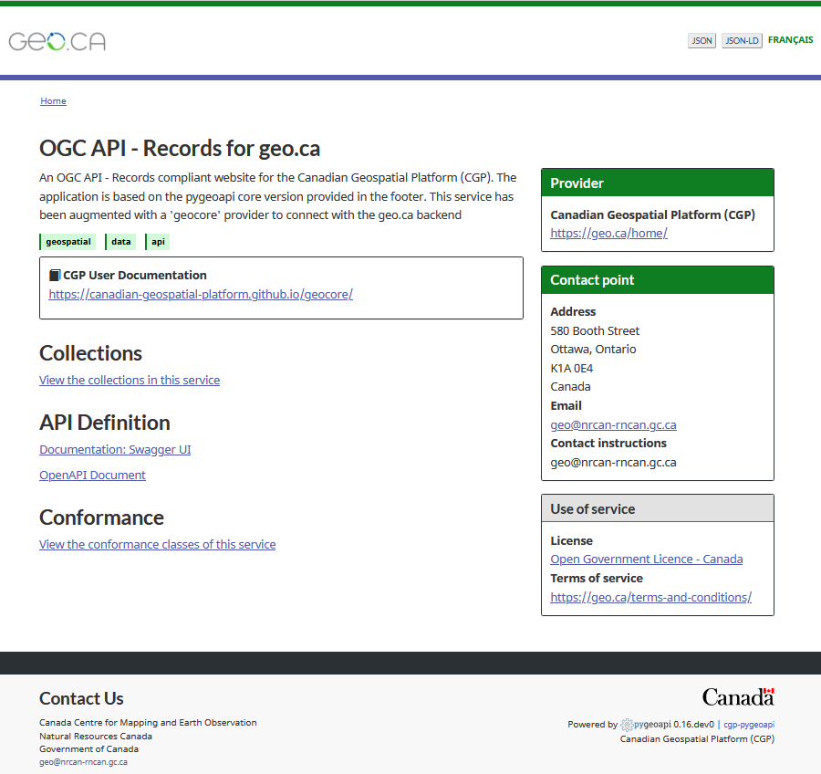
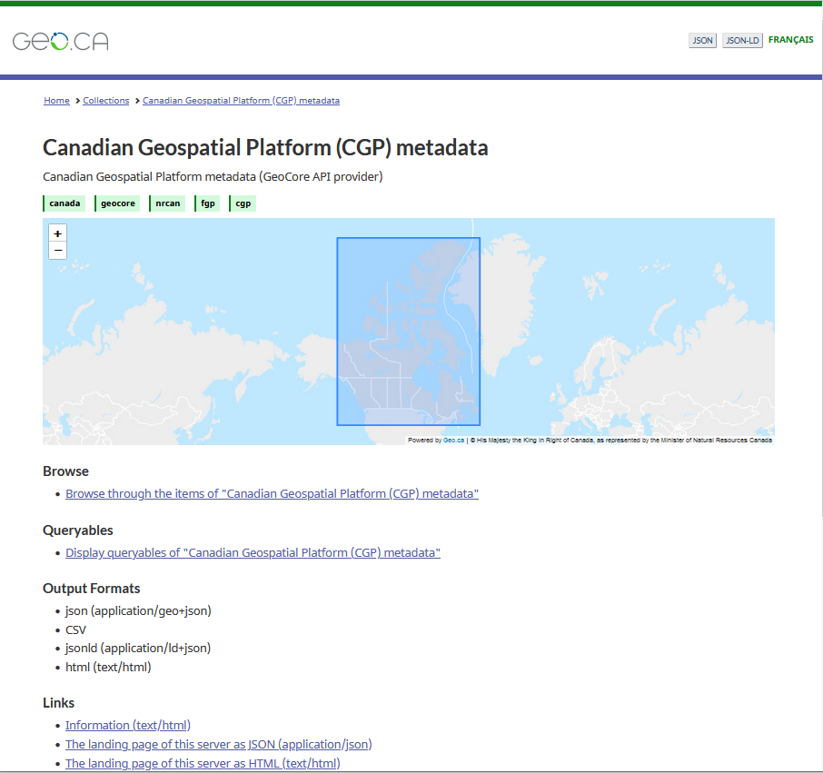
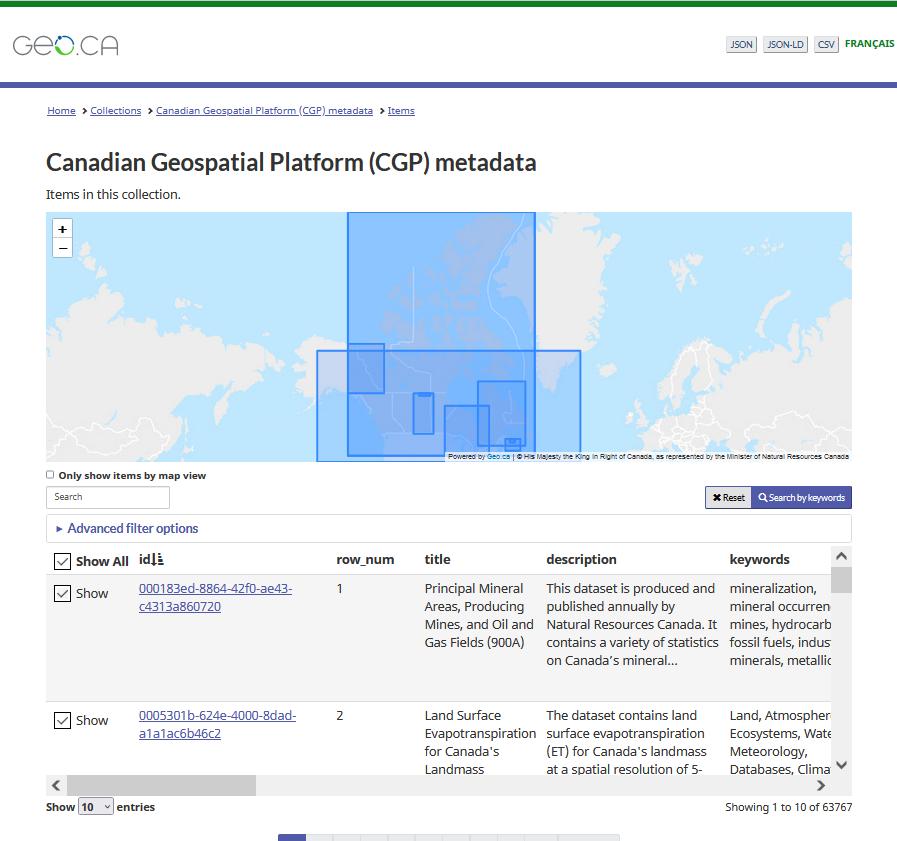

# pygeoapi-geoca-theme
A skin for [pygeoapi](http://pygeoapi.io), based on geo.ca theme, which is in turn using the Canada.ca Web Experience Toolkit (WET)

# Homepage


# Collections


# Items


# Installation

Clone this repository in a folder.
Open pygeoapi config file and uncomment templates section.
Point paths to relevant folders.

```YML
    templates:
      path: /pygeoapi-geoca-theme/templates
      static: /pygeoapi-geoca-theme/static
```

Restart service
